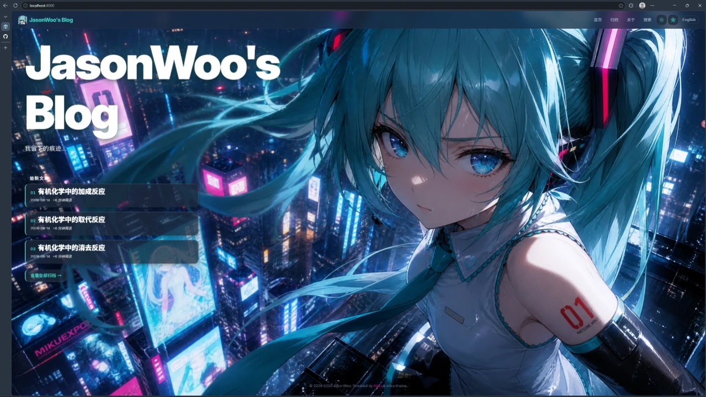
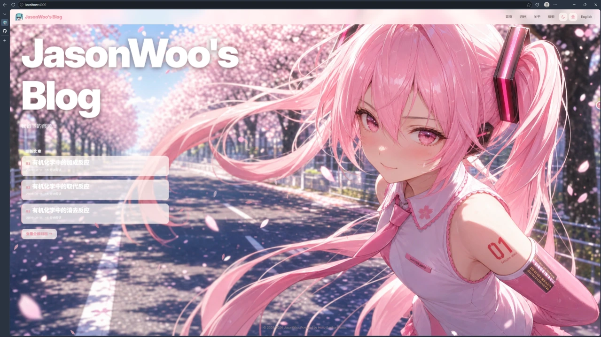
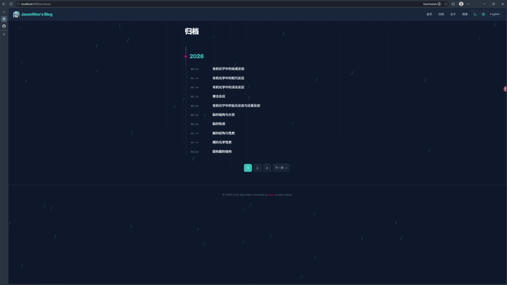
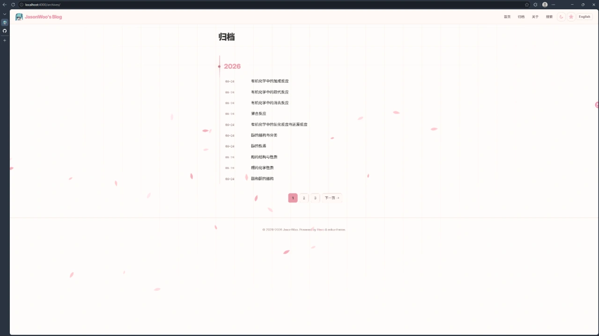
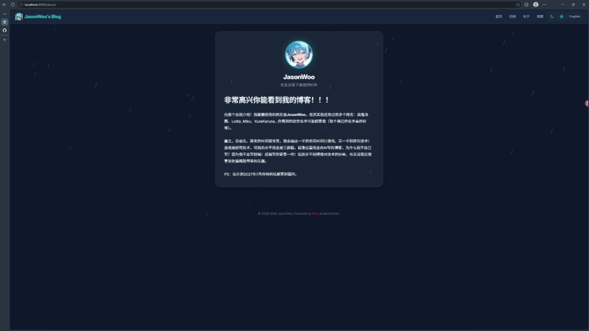

# miku-theme

<div align="center">

**一个为 Hexo 8 设计的 Hatsune Miku 风格个人博客主题**

*A Hatsune Miku themed personal blog theme for Hexo 8*

解构主义 × 新未来主义 · 纯 CSS/原生 JS 动效 · 零动画库依赖

*Deconstructivist × Neo-Futuristic · Pure CSS/Native JS Motion · Zero Animation Library*

</div>

---

## 📸 效果展示 / Screenshots

| | |
|:---:|:---:|
|  |  |
|  |  |
|  | |

---

## ✨ 功能 / Features

### 🏠 首页 / Homepage
- **双主题视差英雄区** — 亮色/暗色模式自动切换背景图，粒子画布（樱花/雨丝），前景视差滚动
- **最新文章卡片** — 展示最近 3 篇文章，带序号、标题、日期和阅读时间
- **主题感知** — 背景图通过 CSS 变量随 `data-theme` 切换，无闪烁
- **入场动画** — CSS 关键帧阶梯动画，背景升起 → 标题逐行出现 → 卡片滑入 → 归档链接淡入

### 📝 文章页 / Post Page
- **封面图** — 支持 `headimg` / `cover` / `thumbnail` 优先级回退，带视差滚动
- **阅读时间** — 自动估算（约 500 字符/分钟），支持开关
- **自动目录 (TOC)** — 从 h2/h3 自动生成，固定左侧边栏（>1280px），滚动高亮当前章节
- **上一篇/下一篇导航** — 带标题预览的翻页卡片
- **代码块增强** — highlight.js 主题配色、行号、复制按钮（含成功/失败状态反馈）
- **标签药丸** — 点击跳转到搜索页按标签筛选

### 🔍 搜索页 / Search Page
- **全文搜索** — 基于 `hexo-generator-searchdb` 的客户端搜索，200ms 防抖
- **关键词高亮** — `<mark>` 包裹匹配词，带渐隐辉光动画
- **标签云筛选** — 按文章数量加权（xs ~ xl 五级尺寸），高亮当前标签
- **URL 参数同步** — `?q=关键词&tag=标签名`，支持浏览器前进/后退
- **组合筛选** — 可同时按关键词和标签筛选，显示结果数和当前筛选条件
- **无障碍** — `aria-live="polite"` 实时播报搜索结果变化

### 📦 归档/分类/标签 / Archives & Categories & Tags
- **归档页** — 按年份分组的时间线布局，带几何装饰点和进度轨道，分页支持
- **分类页** — 分类列表 + 当前分类下的文章卡片
- **标签兼容页** — 旧 `/tags/` 和 `/tags/<name>/` 链接自动重定向到搜索页

### 🎨 视觉系统 / Visual System
- **亮色/暗色双主题** — 粉色系（亮）vs 青色系（暗），`localStorage` 持久化，无闪烁切换
- **玻璃拟态** — `backdrop-filter: blur()` 导航栏、卡片、面板
- **响应式布局** — 1280px / 900px / 768px / 640px / 560px 五级断点
- **聚光灯效果** — 鼠标跟随径向渐变，覆盖文章卡片、搜索结果、关于卡片、代码块和导航
- **滚动进度条** — 页面顶部 2px 渐变线，lerp 平滑
- **交互微动** — 按钮/卡片 hover 抬升（CSS `translateY`），导航下划线动效
- **浮动引言** — `.floating-quote` 类名可创建脉动文字阴影的引用块

### 🌐 国际化 / i18n
- **服务端渲染** — YAML 语言文件 (`zh-CN.yml` / `en.yml`)
- **运行时切换** — 点击语言按钮即时切换界面文案，无需刷新
- **语言持久化** — `localStorage` 记录语言偏好
- **搜索联动** — 语言切换时搜索结果标签自动刷新

### ♿ 可访问性 / Accessibility
- **跳转主内容链接** — 第一个可聚焦元素
- **ARIA 标签** — 导航、按钮、搜索区均有 `aria-label` / `aria-pressed` / `aria-live`
- **键盘导航** — Escape 关闭移动菜单，`focus-visible` 样式
- **减少动画** — `prefers-reduced-motion: reduce` 完全禁用动效，所有元素静态可见
- **语义化 HTML** — 正确的 `role` 地标、Schema.org `Article` 结构化数据

### 🎬 动效系统 / Motion System
- **零依赖** — 无 GSAP、无 ScrollTrigger、无 jQuery
- **统一 Reveal 语言** — `.reveal` / `.reveal-stagger` / `.reveal-subtle` 三类入场动画
- **CSS 控制时间** — 缓动曲线、持续时间和距离全部通过 CSS 自定义属性定义
- **JS 控制状态** — `IntersectionObserver` 切换 `.is-visible`，单 `rAF` 循环驱动视差和进度条
- **共享 Token** — `variables.css` 和 `main.js` 中的 `TIMING` 对象保持同步
- **粒子系统** — Canvas 实现的樱花（亮色）和雨丝（暗色）环境特效，可独立开关
- **入场编舞** — 首页 hero 区域的 CSS `@keyframes` 阶梯动画

### 🧮 数学公式 / MathJax
- **按需加载** — 仅在包含数学标记的文章页和搜索页加载 MathJax 3
- **配置脚本** — 提供 `examples/mathjax.js`，保留 Hexo Markdown 渲染器中的 `$...$` / `$$...$$`
- **TOC 兼容** — 目录中的 MathJax 容器自动复制，避免内容丢失

---

## 📋 环境要求 / Requirements

| 依赖 | 版本 |
|------|------|
| Node.js | ≥ 18 |
| Hexo | 8.x |
| EJS 渲染器 | `hexo-renderer-ejs` |
| Markdown 渲染器 | `hexo-renderer-marked` |

**必需的 Hexo 插件 / Required Hexo Plugins：**

```bash
# 核心 / Core
npm install hexo@^8 hexo-renderer-ejs hexo-renderer-marked hexo-server

# 生成器 / Generators
npm install hexo-generator-index hexo-generator-archive hexo-generator-category hexo-generator-tag

# 搜索 / Search
npm install hexo-generator-searchdb
```

---

## 🚀 快速开始 / Quick Start

### 1. 安装主题 / Install Theme

```bash
cd your-hexo-site
git clone https://github.com/KureKaruna/miku-theme.git themes/miku-theme
```

### 2. 启用主题 / Activate Theme

编辑 Hexo 根目录 `_config.yml`：

```yaml
theme: miku-theme
language: zh-CN
```

### 3. 配置站点 / Configure Site

在根 `_config.yml` 中合并以下推荐配置（替换站点信息）：

```yaml
# 站点信息 / Site Info
title: Your Blog
subtitle: Where melodies become words
description: Your site description
keywords: blog, hatsune miku, vocaloid
author: Your Name
language: zh-CN

# URL
url: https://example.com
permalink: :year/:month/:day/:title/

# 主题 / Theme
theme: miku-theme

# 代码高亮 / Syntax Highlight
syntax_highlighter: highlight.js
highlight:
  line_number: true
  auto_detect: false
  tab_replace: ''
  wrap: true
  hljs: false

# 首页分页 / Index Pagination
index_generator:
  path: ''
  per_page: 10
  order_by: -date

per_page: 10
pagination_dir: page

# 搜索索引 / Search Index
search:
  path: search.xml
  field: post
  content: true
  format: html
```

### 4. 创建必要页面 / Create Required Pages

```bash
hexo new page about
hexo new page search
hexo new page tags
```

编辑 `source/about/index.md`：

```markdown
---
title: 关于
layout: about
---

这里写你的自我介绍。
```

编辑 `source/search/index.md`：

```markdown
---
title: 搜索
layout: search
---
```

编辑 `source/tags/index.md`：

```markdown
---
title: 标签
layout: tags
---
```

### 5. 启动 / Launch

```bash
hexo clean
hexo generate
hexo server
```

访问 `http://localhost:4000` 查看效果。

---

## ⚙️ 主题配置 / Theme Configuration

编辑 `themes/miku-theme/_config.yml`：

```yaml
# 导航 / Navigation
# 键名会通过语言包翻译。支持: Home, Archives, Tags, About, Search
nav:
  Home: /
  Archives: /archives/
  About: /about/
  Search: /search/

# 页脚 / Footer
copyright:
  since: 2026          # 起始年份
  author: Blog Author  # 作者名

# 功能开关 / Feature Toggles
features:
  toc: true            # 文章目录
  parallax: true       # 首页视差英雄区
  back_to_top: true    # 回到顶部按钮
  search: true         # 全站加载搜索脚本（搜索页始终加载）

# 首页英雄 / Homepage Hero
hero:
  title: "Miku's Blog"              # 标题（在首页拆为两行显示）
  subtitle: "旋律化为文字之处"       # 副标题

# 文章设置 / Post Settings
post:
  date_format: "YYYY-MM-DD"  # moment.js 日期格式
  reading_time: true         # 显示阅读时间

# 头像 / Avatar
avatar: "/images/avatar.webp"

# 搜索 / Search
search:
  path: search.xml   # 需与根 _config.yml 的 search.path 一致
```

### 配置说明 / Configuration Notes

| 配置项 | 类型 | 说明 |
|--------|------|------|
| `nav` | Map | 导航菜单。键名通过 `navKeys` 映射到 i18n 翻译。支持 `Home`、`Archives`、`Tags`、`About`、`Search` |
| `copyright.since` | Number | 页脚版权起始年份，显示为 `since–currentYear` |
| `copyright.author` | String | 页脚版权作者名 |
| `features.toc` | Boolean | 控制是否在文章页生成 TOC |
| `features.parallax` | Boolean | 控制首页视差效果 |
| `features.back_to_top` | Boolean | 控制"回到顶部"按钮 |
| `features.search` | Boolean | 为 `true` 时全站加载 `search.js`。搜索页始终加载 |
| `hero.title` | String | 首页标题，自动拆分为两行显示（第一段 + 最后一个单词） |
| `hero.subtitle` | String | 首页副标题 |
| `post.date_format` | String | moment.js 日期格式字符串 |
| `post.reading_time` | Boolean | 是否在文章卡片和文章页显示预计阅读时间 |
| `avatar` | String | 关于页头像路径，相对于 `source/images/` |
| `search.path` | String | 搜索索引文件名，需与根 `_config.yml` 的 `search.path` 一致 |

---

## 📝 文章 Front Matter / Post Front Matter

### 封面图字段

主题支持三个封面图字段，按优先级回退：

```yaml
---
title: 示例文章
date: 2026-01-01 12:00:00
tags:
  - Hexo
  - 教程
categories:
  - Blog
headimg: /images/posts/example-head.webp   # 文章页顶部封面（最高优先级）
cover: /images/posts/example-cover.webp     # 文章卡片 + 文章页封面
thumbnail: /images/posts/example-thumb.webp # 文章卡片（fallback）
---
```

**优先级规则：**

| 场景 | 优先级 |
|------|--------|
| 文章页顶部封面 | `headimg` → `cover` → `thumbnail` |
| 文章卡片封面 | `cover` → `thumbnail` |
| Open Graph 图片 | `cover` → `thumbnail` → 默认图 |

### 完整 Front Matter 示例

```yaml
---
title: "你好，世界"
date: 2026-06-19 15:30:00
updated: 2026-06-19 18:00:00
tags:
  - 入门
  - Hexo
categories:
  - 教程
cover: /images/posts/hello-world.webp
description: 这是我的第一篇博客文章。
keywords: hexo, 博客, 教程
---
```

---

## 🧮 数学公式支持 / MathJax Support

### 工作原理

1. **宿主站点脚本** — 将 `examples/mathjax.js` 复制到站点的 `scripts/` 目录，它通过 Hexo 的 `marked` 扩展保留 Markdown 中的 `$...$` 和 `$$...$$` 分隔符
2. **主题自动加载** — 当文章内容包含数学标记或当前为搜索页时，主题自动从 CDN 加载 MathJax 3（tex-chtml）
3. **TOC 兼容** — 目录中的数学公式容器会被自动复制

### 配置步骤

```bash
# 将 mathjax 脚本复制到站点
cp themes/miku-theme/examples/mathjax.js scripts/mathjax.js
```

最终目录结构：

```text
your-hexo-site/
├── scripts/
│   └── mathjax.js        # ← 数学标记保留脚本
└── themes/
    └── miku-theme/
```

### 使用方法

```markdown
行内公式：$E = mc^2$

块级公式：

$$
\int_0^1 x^2 \, dx = \frac{1}{3}
$$

或者使用 \(...\) 和 \[...\] 分隔符。
```

**MathJax 3 配置：**
- `inlineMath`: `[['$','$'], ['\(','\)']]`
- `displayMath`: `[['$$','$$'], ['\[','\]']]`
- `processEscapes: true`

---

## 🌐 国际化 / Internationalization

### 语言文件

| 文件 | 用途 |
|------|------|
| `languages/zh-CN.yml` | 服务端渲染中文翻译 |
| `languages/en.yml` | 服务端渲染英文翻译 |
| `layout/partial/footer.ejs` | 运行时 `window.MIKU_I18N` 语言包（客户端切换） |

### 运行时 i18n 键

所有文本标签通过 `data-i18n` 属性标记，语言切换时 `main.js` 自动替换。支持的 i18n 键包括：

- `nav.*` — 导航菜单
- `home.*` — 首页文案
- `post.*` — 文章页（目录标题、阅读时间、上一篇/下一篇）
- `search.*` — 搜索页（输入框占位符、结果计数、筛选标签）
- `archive.*` — 归档页
- `tags.*` — 标签页
- `category.*` — 分类页
- `pagination.*` — 分页
- `a11y.*` — 无障碍 ARIA 标签
- `theme.*` — 主题切换按钮提示
- `effects.*` — 特效切换按钮提示
- `lang.*` — 语言切换按钮

### 自定义翻译

如需修改或新增翻译：

1. 编辑 `languages/zh-CN.yml` 和 `languages/en.yml`
2. 编辑 `layout/partial/footer.ejs` 中的 `window.MIKU_I18N` 对象（`zh-CN` 和 `en` 两部分）
3. 在模板中使用 `data-i18n="your.key"` 标记元素

---

## 🎨 自定义资源 / Custom Assets

### 图片替换

主题图片位于 `source/images/`，可直接替换同名文件：

| 文件 | 尺寸建议 | 用途 |
|------|---------|------|
| `logo.svg` | 任意正方形 | 导航栏品牌 Logo |
| `hero-light-bg.webp` | 1920×1080+ | 亮色模式首页背景 |
| `hero-dark-bg.webp` | 1920×1080+ | 暗色模式首页背景 |
| `favicon.png` | 32×32 或 64×64 | 站点图标和 Apple Touch Icon |
| `default-og-image.webp` | 1200×630 | 默认 Open Graph 分享图 |
| `avatar.webp` | 200×200+ | 关于页个人头像 |

你也可以在模板和主题配置中修改图片路径而不覆盖原文件。

### 字体

主题使用 Google Fonts：
- **Inter**（400–900 字重）— 正文和 UI
- **Noto Sans SC**（400/500/700/900 字重）— 中文字体

字体链接在 `layout/partial/head.ejs` 中。如果访问 Google Fonts 不稳定，可替换为本地字体或其他 CDN。

---

## 🎬 动效系统详解 / Motion System Details

### 设计原则

主题采用 **CSS 负责时间、JS 负责状态** 的动效架构，无需任何动画库。

### 共享 Token

| Token | CSS 变量 | JS 常量 | 值 |
|-------|---------|---------|-----|
| Reveal 距离 | `--reveal-distance` | — | `24px` |
| Reveal 时长 | `--reveal-duration` | — | `300ms` |
| Reveal 间隔 | `--reveal-stagger` | `TIMING.revealStagger` | `35ms` |
| Reveal 稳定 | — | `TIMING.revealSettle` | `600ms` |
| 滚动平滑 | — | `TIMING.scrollLerp` | `0.12` |
| 高亮辉光时长 | — | `TIMING.markGlowDuration` | `800ms` |

### CSS 入场词汇 / Reveal Vocabulary

| 类名 | 说明 |
|------|------|
| `.reveal` | 单元素入场：从下 24px 淡入 + 微缩 |
| `.reveal-stagger` | 容器：子元素依次入场（JS 分配 `--i` 索引） |
| `.reveal-subtle` | 轻量版：10px 位移，18ms 间隔，适用于密集列表 |
| `.is-visible` | JS 观察器切换的可见状态 |
| `.will-animate` | 瞬态 `will-change: transform, opacity` 提升（JS 在前后添加/移除） |
| `.motion-on` | `<html>` 类名，控制所有动效开关 |
| `.motion-off` | `<html>` 类名，强制所有元素可见，禁用动效 |
| `.hero-enter` | 首页入口触发器，启动 CSS `@keyframes` 阶梯动画 |
| `.lift-on-hover` | 纯 CSS hover 效果：`translateY(-2px) scale(1.015)` |
| `.spotlight-surface` | 鼠标跟踪聚光灯效果容器 |

### 首页入场编舞

`.hero-enter` 触发后，按以下延迟依次播放：

1. **背景升起**（0s）— 缩放 1.06 → 1，模糊 8px → 0（1.15s）
2. **标题第一行**（+0.08s）— 从下 0.42em 升起（0.85s）
3. **标题第二行**（+0.2s）
4. **副标题**（+0.42s）
5. **文章卡片 1**（+0.55s）— 从左下 (-28px,18px) 滑入
6. **文章卡片 2**（+0.66s）
7. **文章卡片 3**（+0.77s）
8. **归档链接**（+0.88s）
9. **页脚版权**（+0.95s）

### 减少动画 / Reduced Motion

```css
@media (prefers-reduced-motion: reduce) {
  .motion-on .reveal { opacity: 1; transform: none; }
  /* 所有动画时长设为 0.001ms */
}
```

当用户系统设置 `prefers-reduced-motion: reduce` 时，`<html>` 自动切换为 `.motion-off`，所有元素立即可见。

### JS 动效 API

主题暴露 `window.MIKU_ANIMATE` 全局对象：

```javascript
// 刷新动效（重新扫描 reveal 元素 + 重算视差）
window.MIKU_ANIMATE.refresh()

// 还原动效（断开观察器 + 停止循环 + 强制可见）
window.MIKU_ANIMATE.revert()
```

---

## 🔧 环境特效 / Ambient Effects

| 模式 | 特效 | 颜色 | 粒子数 | 描述 |
|------|------|------|--------|------|
| 亮色 | 樱花 | 粉色系 | ≤25 | 贝塞尔曲线花瓣，从右侧飘入，带摇摆动画 |
| 暗色 | 雨丝 | 青色系 | ≤50 | 斜线雨滴，从顶部飘落 |

- **开关**：导航栏右侧特效按钮（樱花图标），状态持久化到 `localStorage`（`miku-effects-pref`）
- **性能**：标签页不可见时自动暂停，`prefers-reduced-motion` 时禁用
- **Canvas**：全视口 `#sakuraCanvas`，`pointer-events: none`

---

## 📁 项目结构 / Project Structure

```text
miku-theme/
├── _config.yml                      # 主题配置
├── .gitignore                       # Git 忽略规则
├── LICENSE                          # 许可证
├── README.md                        # 本文件
│
├── languages/                       # 服务端语言文件
│   ├── en.yml                       # 英文翻译
│   └── zh-CN.yml                    # 中文翻译
│
├── layout/                          # EJS 模板
│   ├── index.ejs                    # 首页
│   ├── post.ejs                     # 文章页
│   ├── archive.ejs                  # 归档页
│   ├── search.ejs                   # 搜索页
│   ├── about.ejs                    # 关于页
│   ├── category.ejs                 # 分类页
│   ├── tag.ejs                      # 单标签兼容页（重定向）
│   ├── tags.ejs                     # 标签索引兼容页（重定向）
│   └── partial/                     # 共享组件
│       ├── head.ejs                 # 文档头部（meta、SEO、字体、主题检测）
│       ├── header.ejs               # 导航栏
│       ├── footer.ejs               # 页脚 + i18n 运行时包 + 脚本加载
│       ├── article-card.ejs         # 文章卡片组件
│       └── parallax-hero.ejs        # 首页视差英雄区
│
├── examples/                        # 示例脚本
│   └── mathjax.js                   # MathJax 标记保留脚本（复制到站点 scripts/）
│
├── demo/                            # 效果截图
│   ├── demo1.webp
│   ├── demo2.webp
│   ├── demo3.webp
│   ├── demo4.webp
│   └── demo5.webp
│
└── source/                          # 前端资源
    ├── css/
    │   ├── variables.css            # 设计 Token（颜色、排版、圆角、动效变量）
    │   ├── style.css                # 主样式表（18 个分区）
    │   └── highlight.css            # 代码高亮样式
    ├── images/
    │   ├── logo.svg                 # 导航 Logo
    │   ├── hero-light-bg.webp       # 亮色首页背景
    │   ├── hero-dark-bg.webp        # 暗色首页背景
    │   ├── favicon.png              # 站点图标
    │   ├── default-og-image.webp    # 默认 OG 图
    │   └── avatar.webp              # 默认头像
    └── js/
        ├── main.js                  # 核心脚本（主题/语言切换、TOC、动效、粒子、聚光灯）
        └── search.js                # 客户端搜索脚本
```

---

## 🔍 搜索调试 / Search Debugging

### 搜索无结果

1. 确认已安装 `hexo-generator-searchdb`
2. 运行 `npm run build`（或 `hexo generate`）
3. 确认项目根目录生成了 `public/search.xml`
4. 确认根 `_config.yml` 和主题 `_config.yml` 中的 `search.path` 一致（默认 `search.xml`）

### 搜索索引格式

主题期望 `search.xml` 包含以下字段的 `<entry>`：

```xml
<entry>
  <title>文章标题</title>
  <url>/permalink/</url>
  <content>文章全文 HTML</content>
  <date>2026-01-01</date>
  <tag>标签1,标签2</tag>
</entry>
```

---

## ❓ 常见问题 / FAQ

### 页面初次加载时内容透明

主题通过 `<html>` 上的 `.motion-on` / `.motion-off` 类控制 reveal 初始状态。不要在 `main.js` 中提前调用 `initMotionController()` — 所有常量和 helper 函数必须在其之前声明。

### 数学公式不渲染

1. 确认 `scripts/mathjax.js` 已从 `examples/` 复制到站点 `scripts/` 目录
2. 清除缓存重新生成：`hexo clean && hexo generate`
3. 检查文章中的 `$` 符号没有被 Markdown 渲染器转义

### Google Fonts 加载缓慢

编辑 `layout/partial/head.ejs`，将 Google Fonts 的 `<link>` 替换为本地字体或其他 CDN（如中国区域的 fonts.loli.net 等镜像）。

### 移动端导航不工作

确认 `<html>` 上有 `data-theme` 属性，且 `main.js` 正确加载（检查浏览器控制台错误）。移动端断点为 768px。

### 暗色模式闪烁

`head.ejs` 中的内联脚本在 CSS 加载前同步执行，读取 `localStorage` 或系统偏好。如果仍有闪烁，检查是否有其他脚本修改了 `data-theme` 属性或浏览器缓存了旧状态。

### 如何禁用粒子特效

有两种方式：
1. 点击导航栏特效切换按钮（樱花图标）关闭
2. 在系统设置中开启「减少动画」，主题会自动禁用所有特效

---

## 🛠️ 开发 / Development

### 本地调试主题

```bash
# 克隆博客站点
git clone <your-blog-repo>
cd your-blog

# 安装依赖
npm install

# 克隆主题到 themes 目录
git clone https://github.com/KureKaruna/miku-theme.git themes/miku-theme

# 启动开发服务器（带实时预览）
hexo server
```

### 修改样式

主题使用纯 CSS（非预处理），直接编辑 `source/css/` 中的文件即可：

- `variables.css` — 修改颜色、间距、动效参数
- `style.css` — 修改布局和组件样式
- `highlight.css` — 修改代码高亮配色

### 修改脚本

- `main.js` — 核心交互逻辑（主题/语言切换、TOC、动效、粒子）
- `search.js` — 搜索索引加载和结果渲染

**注意**：`main.js` 中的函数声明顺序很重要。所有常量（`TIMING`、`REVEAL_SELECTOR` 等）和辅助函数必须在 `initThemeFeatures()` 调用之前声明。

### 修改模板

编辑 `layout/` 中的 EJS 模板。模板使用 Hexo 的 API：

- `theme.*` — 访问主题配置
- `config.*` — 访问站点配置
- `__('key')` — 服务端 i18n 翻译
- `site.*` — 访问站点数据
- `page.*` — 访问当前页面数据
- `is_home()` / `is_post()` / `is_archive()` 等 — 页面类型判断

### 新增 i18n 键

1. 在 `languages/zh-CN.yml` 和 `languages/en.yml` 中添加翻译
2. 在 `layout/partial/footer.ejs` 的 `window.MIKU_I18N` 对象中添加对应键值
3. 在 EJS 模板中使用 `data-i18n="your.new.key"` 标记元素

---

## 📄 许可证 / License

MIT License — 详见 [LICENSE](./LICENSE) 文件。

---

<div align="center">

**[KureKaruna/miku-theme](https://github.com/KureKaruna/miku-theme)**

Made with ❤️ and a lot of 🎵

</div>
